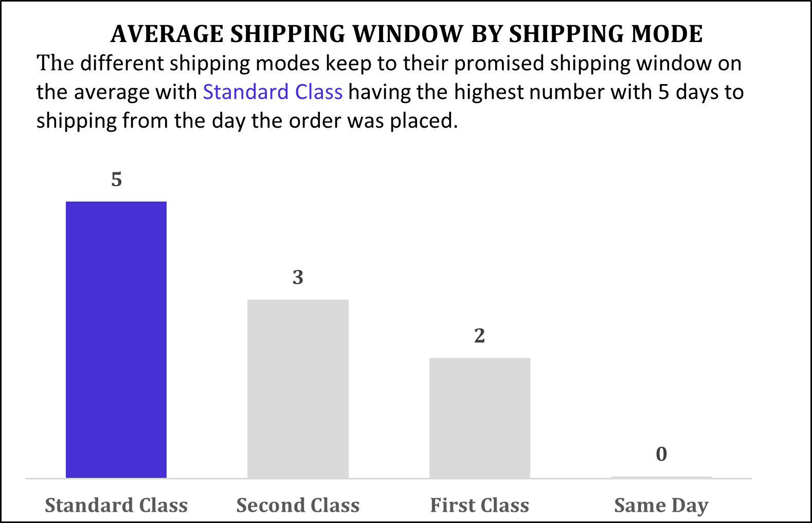
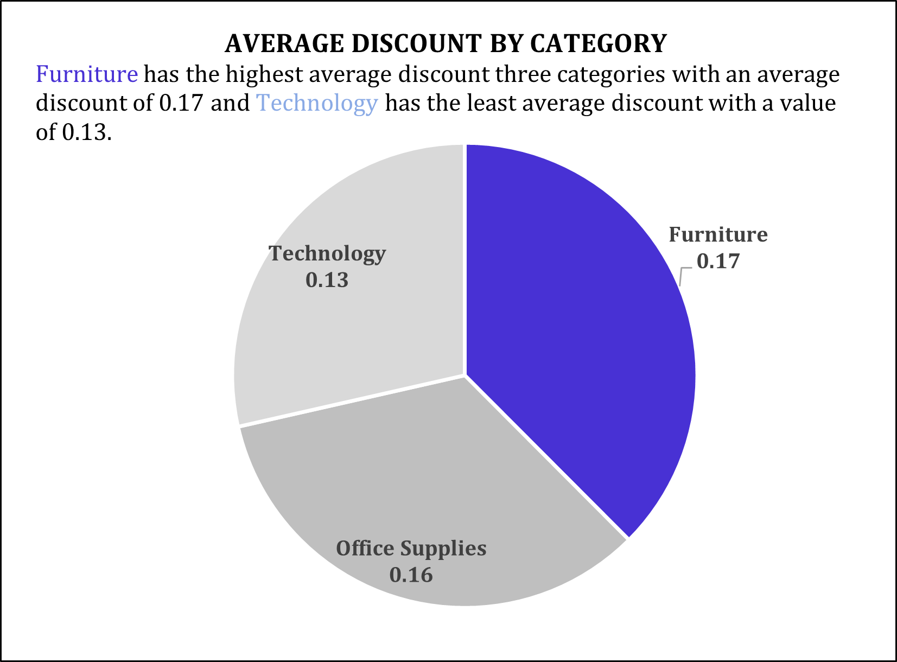
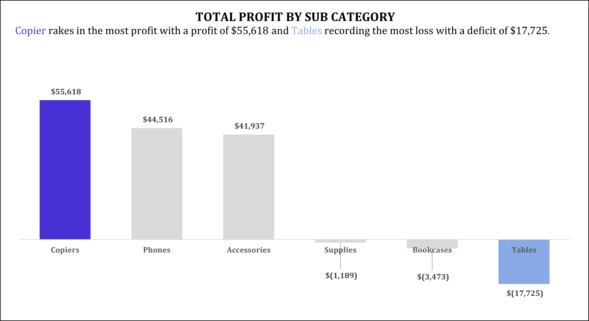
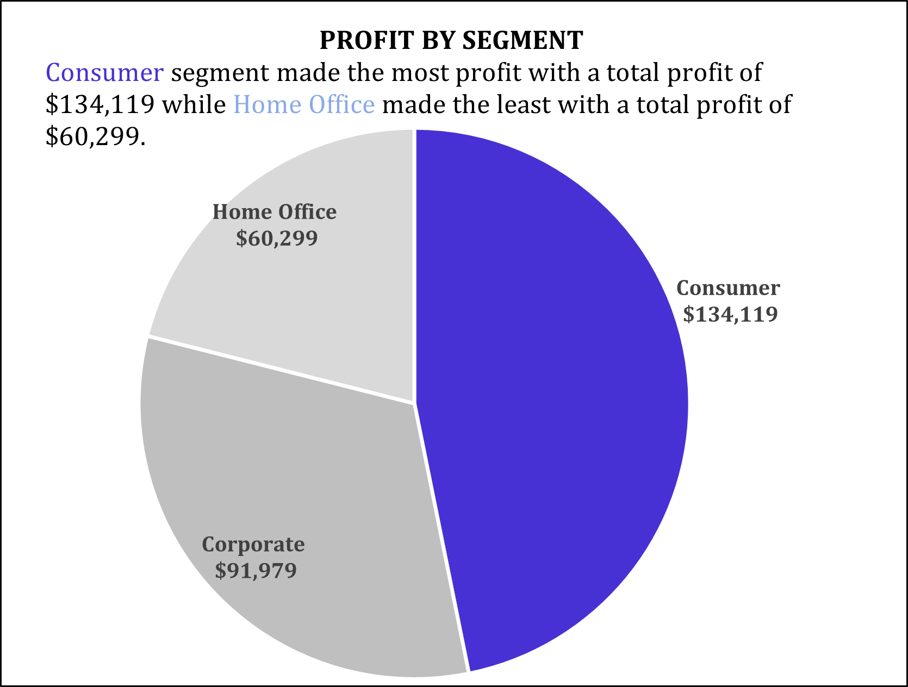
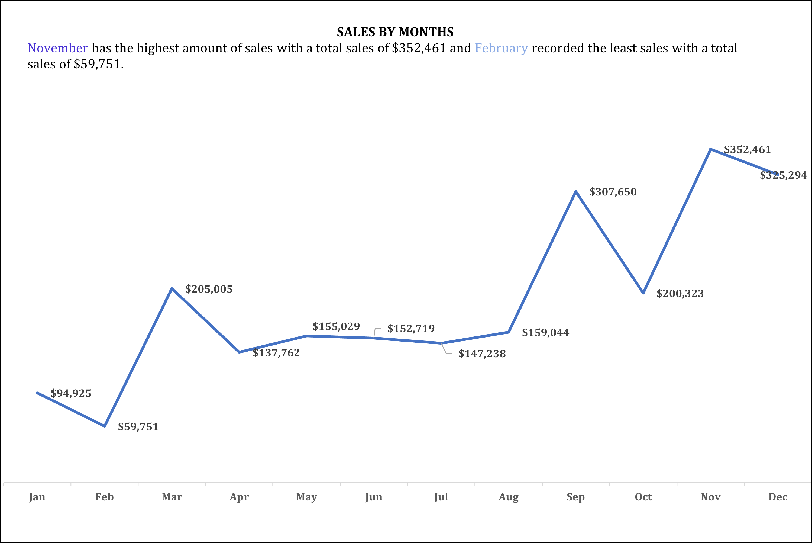
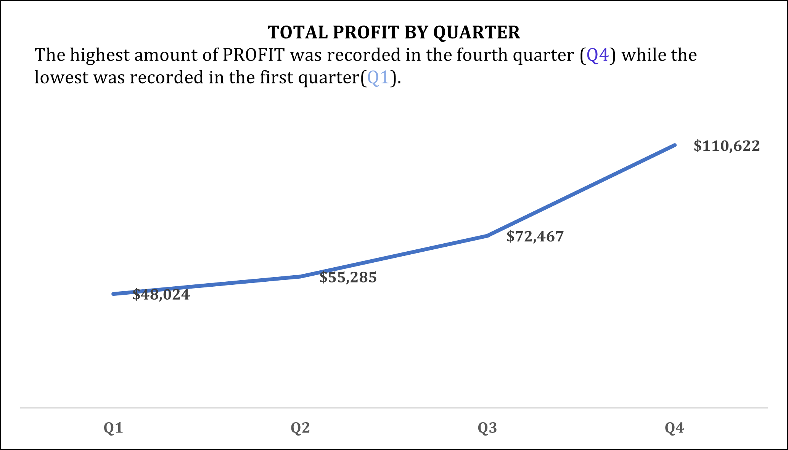

# Excel-SuperStore_Analysis 🏬

## Business Problem 🕴️
The manager at U.S Superstore presented me with the following business problem:
We're entering a new business year, and based on the company's sales performance in the previous year, are there any specific segments, quarters, months, products, or countries to which we should pay more attention to? We need these pointers to perform better and make informed decisions in the coming year.

## Questions to answer ❓

After carefully digesting the demands of the business manager and the data available, I have come up with the following questions to potentially find answers to using the available dataset:

### KPI
- What is the total sales?
- What is the total profit?
- What is the quantity sold?
- What is the average shipping time?
- What is the total sales margin?

 ### Questions to answer. 
- What is the average shipping window for each shipping mode?
- Which states make the most quantity of sales, sales, and profit?
- Which category and sub-categories make the most profit?
- Which region makes the most profit?
- What category and sub-category offers the most discount?
- What segment makes the most profit?
- What category makes the most quantity of sales?
- What months have the highest sales and profit?
- What quarter has the highest sales, profit, and profit margin?

## Data Cleaning 🧹
The data we retrieved from the company's database was clean so I had no data cleaning to do, so, to answer the questions we posed and ultimately help the manager, I needed to create a few more columns of data from the columns in the original data:
- I created a _ship time_ column by subtracting the _Ship Date_ from the _Order Date_ column. This gave us the number of days it took to ship a product from the day the product was ordered.
- I also created an _Order Quarter_ column which helps to put the dates products were ordered into the 4 different quarters in a year. To do this, I created a _Order month_ column and then used the following formula to get the quarter each month falls into `=IFS(W2<=3, "Q1", W2<=6, "Q2", W2<=9, "Q3", W2<=12, "Q4")`
- I calculated the profit margin using the formula `=(U2/R2)*100` and placed it in the _Profit Margin_ column.
- I lastly created the order month column using the formula `=TEXT(C2, "mmmm")`.

## Data Analysis 🧑‍🔧
I created pivot tables to answer the questions and also answered the Key Performance Index questions

## KPI
I answered the Key Performance Index questions using the following formulas:

KPI                     | Formula
------------------------|------------
Total Sales             |`=SUM('Sample - Superstore'!R2:R9995)`
Total Quantity Sold     |`=SUM('Sample - Superstore'!S2:S9995)`
Total Profit            |`=SUM('Sample - Superstore'!U2:U9995)`
Profit Margin           |`=('Pivot Tables'!C4/'Pivot Tables'!C2)*100`
Average Shipping Window |`=AVERAGE('Sample - Superstore'!V2:V9995)`

The resulting KPIs are as follows:

## Visualisations
Using the pivot tables created, I made visuals to answer the questions posed so as to help the manager make his decision-making process easier.

- We inspected the average time it took for orders to be shipped and they returned in line with the time promised based on the shipping mode the customers selected while placing their orders. This is an area of strength that the manager should look to maintain.

---
- Looking at the sales unit, sales value, profit, and profit margin by state, California and New York stand out as leading in these metrics and the manager needs to take note of these states for further business in the coming year. The 2 states are the company's stronghold and that needs to be maintained.

---
- Proft, discount, and quantity of sales by category reveal that technology raked in the most profit despite not selling the most units of the product while also offering the least average discount. This is a point to note for the manager. Increasing the average discount on Technology products might make the category record even more sales and profit.

---
- Total profit and average discount by sub-category reveal that the sub-categories with the most average discount do not make the most profit, even though some of them ended up with high values in losses. This might be an indicator that there is a fault in the discount system that needs to be looked into and rectified.

---
- The consumer segment brought in the most profit in the year ending.

---
- The West region alone made nearly half of the profit made overall. That is an indicator that the region is a huge success and needs to be maintained.

---
- A huge part of the sales and profit is made in the ember months which makes the fourth quarter(Q4) the most successful quarter in the companies' year. This needs paying attention to for subsequent year plans.

## Conclusion
In conclusion, the manager has a lot to look into in terms of what makes the successful months, quarters, regions, categories, sub-categories, and states successful and the under-performing ones under-perform. Marrying these reasons can only make the company do even better in the coming year. ⏫
